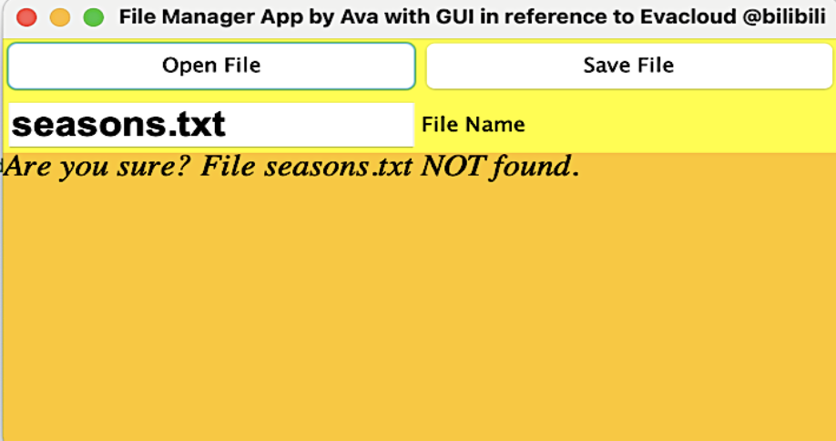

# Repo File Manager App to Streamline Your Virtual Experiences

In this report, an application named FileRepo is developed for Lockers Pvt. Ltd. to manage files in a designated repository. Please see FileRepo GitHub Repository and FileRepo Complete [Scrum Report](https://coda.io/d/AvaLee-Phase1-FSD-ScrumProject_dEJzqaDt_rL/Introduction_sugxz#_lu3lb).

## Capabilities
The product is designed with two options. Option 1 offers retrieval of files in the repository in ascending order. Option 2 includes services to read, write, add and delete files. In commercial production, a free-to- all Tier 1 can include Option 1 and file reading feature of Option 2. Tier 2 offering file writing, addition and deletion services would be the paid enterprise choice. Java is used for the development of this
application. Packages imported include JFrame GUI, arrays, file and exception handling.

## Appearance
The GUI of the application appears as follows. The application name and developer details are displayed
in the title. Users are able to close and exit the program.

## User Interactions
There is a button to open a specified file by entering the file name in the blank field on the second line.

If a searched file does not exist in the repository, a corresponding message will be displayed in the bottom orange section.

A new file will be added by typing in the file name and writing down contents in the orange field on the bottom.

Features to retrieve titles of files stored in a folder in ascending order and delete a specified file, test.txt, from the repository:

## Development Cycle
Three sprints contributed to the product development during the agile scrum process. Each cycle lasts for
a week.

_Feb 15, 2021 to Feb 21, 2021_

**Sprint 1**: a. Design GUI in RepoScanner.java; b. Class to display files in a repository in ascending order in FileRetriever.java for Option 1

_Feb 22, 2021 to Feb 28, 2021_

**Sprint 2**: a. Define a class to delete a file in FileDeletion.java as part of Option 2, enterprise tier, possibly paid services; b. Design buttons in RepoScanner.java and integrate, as part of Option 2, file reading and writing features with exception handling messages; c. Optimize sorting algorithms in file reading by implementing binary search in BinarySearch.java with left and right portions of an array for file titles, applied to RepoScanner file reading, in order to reduce time complexity from O(N) to O(logN), followed by merge sort or other sorting algorithms to optimize Arrays.sort() in the existing file retrieving process in AlphaNumericSort.java that has an average time complexity of O(NlogN) as a combination of quick and merge sort.

_Mar 1, 2021 to Mar 7, 2021_

**Sprint 3**: a. Add function of go in depth for file retrieving using recursive method, followed by BFS or DFS algorithms as part of the optimization process; b. Reorganize GUI to integrate combo boxes as a drop down menu from functional buttons for sorted file retrieval and file deletion options.

## Data Structures
_**Sorting**_
The sorting algorithm in FileRetriever.java is Array.sort(). It implements Timsort, a dual pivot quicksort algorithm of faster speed on numeric values compared to objects. The time complexity is between O(N) and O(NlogN). Its space complexity is O(N). Optimization of the sorting algorithm can include creating an alpha numeric comparator. Capitalize letters will be taken care of in this way.

_**Searching**_
In RepoScanner.java, the search method is currently linear. Time complexity is O(N) whereas N represents the number of files. Optimize using binary search algorithm to reduce the time complexity to O(log(N)) by searching the array of files one half at a time.

## Next Steps
On GUI, for more interactive user experience, create drop down menu with functional buttons
and toggles to navigate from and back to the home page. Add options to deposit files to repositories of various depth. Incorporate RegX into scanning to extract different types of files.

---

## References
https://www.bilibili.com/video/BV19T4y1M7aH
https://www.stackoverflow.com
https://www.geeksforgeeks.org/arrays-sort-in-java-with-examples/ https://stackabuse.com/java-list-files-in-a-directory/
https://stackoverflow.com https://stackoverflow.com/questions/16898029/how-to-sort-file-names-in-ascending-order
http://www.davekoelle.com/files/AlphanumComparator.java
https://stackoverflow.com/questions/28947250/create-a-directory-if-it-does-not-exist-and-then-create- the-files-in-that-direct/28948104
